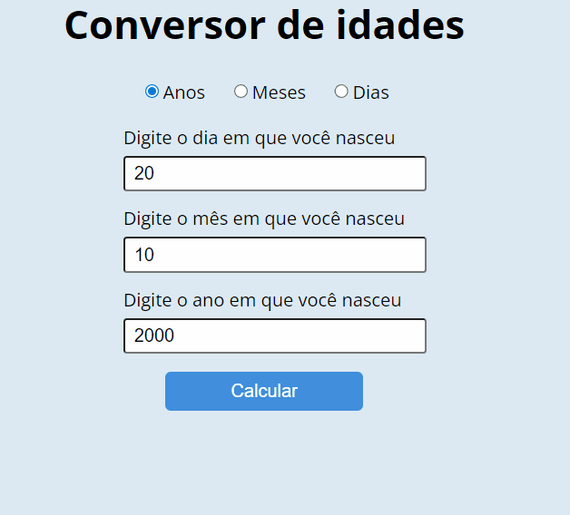

<h1 align="center">Age Converter</h1>

Este projeto converte uma data de nascimento em idade, onde o resultado pode ser em um dos seguintes:

- Anos, meses e dias;
- Meses e dias;
- Dias.

    <a href="#tecnologias">Tecnologias</a> &nbsp;&nbsp;•&nbsp;&nbsp;
    <a href="#testar">Testar</a>

---
 

    

  

## Tecnologias

Para o desenvolvimento deste projeto foram utilizadas as seguintes tecnologias:

- [HTML](https://developer.mozilla.org/pt-BR/docs/Web/HTML)
- [CSS](https://developer.mozilla.org/pt-BR/docs/Web/CSS)
- [JavaScript](https://developer.mozilla.org/pt-BR/docs/Web/JavaScript)

 

## Testar

- Teste o projeto: https://conversordeidades.netlify.app/

---

 

Made with ❤️ by Natãn Teixeira Vieira
